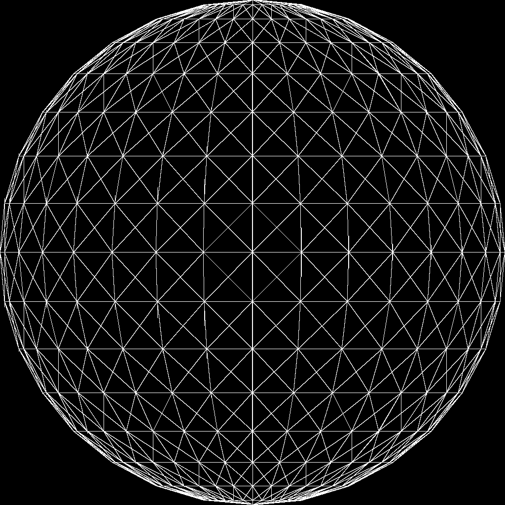
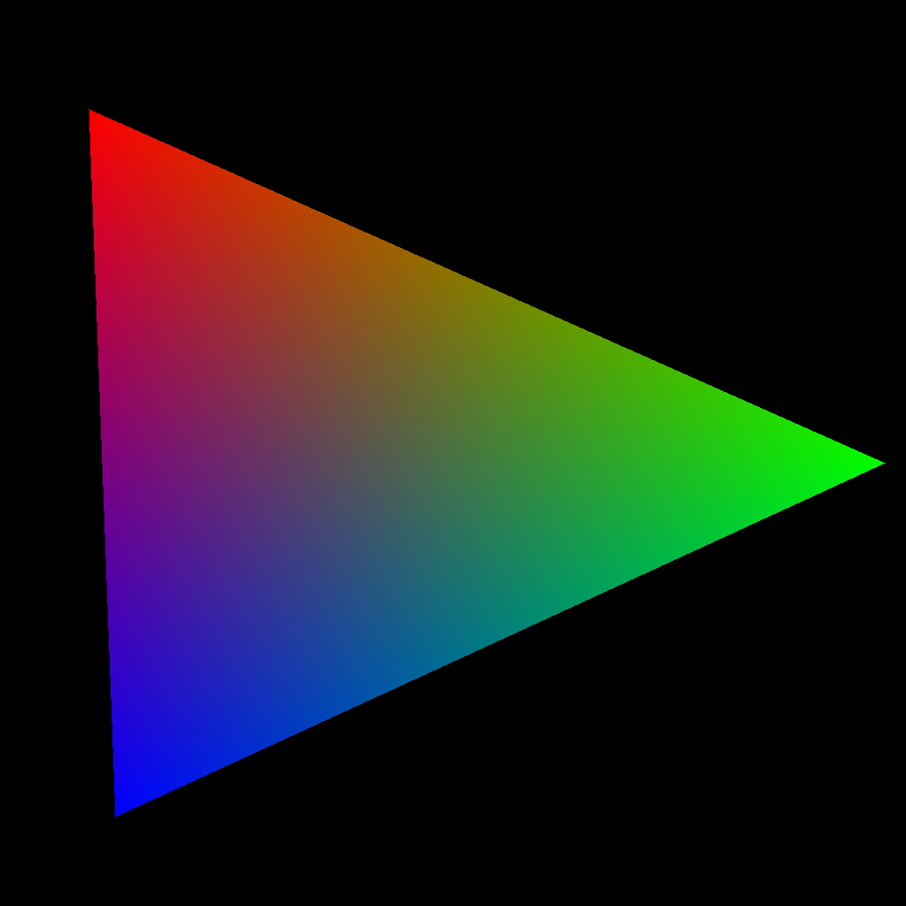
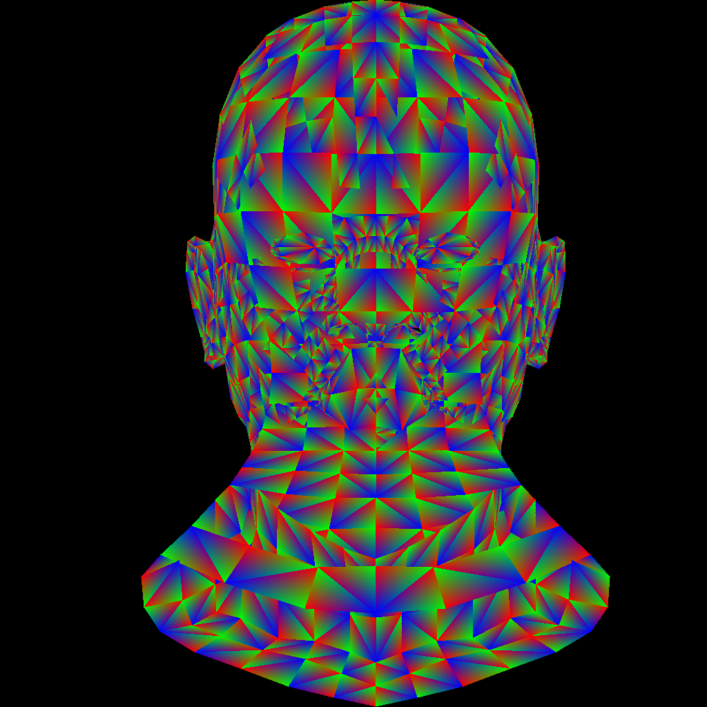

# GoonRenderer

GoonRenderer is Software-rasterizer for improving my c++ language fluency and knowledge about graphics.
I will implement all modules on my hand, from basic module such as math, file io.. etc to renderer.
This is long-term project for two years. 

## Work story

## Motivation
[tiny-renderer project by ssloy](https://github.com/ssloy/tinyrenderer)
